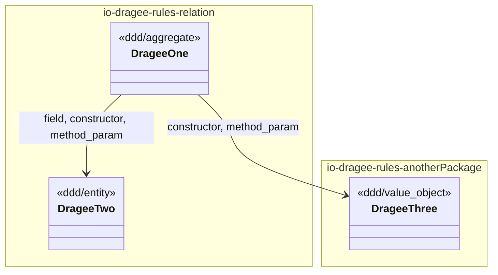

# ddd-grapher

Graph drawer for DDD

### Class Diagram

[Markdown Class Diagram](./src/graphs/ddd-class-diagram.graph.ts) with [mermaidjs](https://github.com/mermaid-js/mermaid)

```mermaid
	classDiagram
	namespace io-dragee-rules-relation {
		class DrageeOne {
			<<ddd/aggregate>>
		}

		class DrageeTwo {
			<<ddd/entity>>
		}
	}
	DrageeOne --> DrageeTwo : field, constructor, method_param
	DrageeOne --> DrageeThree : constructor, method_param

	namespace io-dragee-rules-anotherPackage {
		class DrageeThree {
			<<ddd/value_object>>
		}
	}

```
